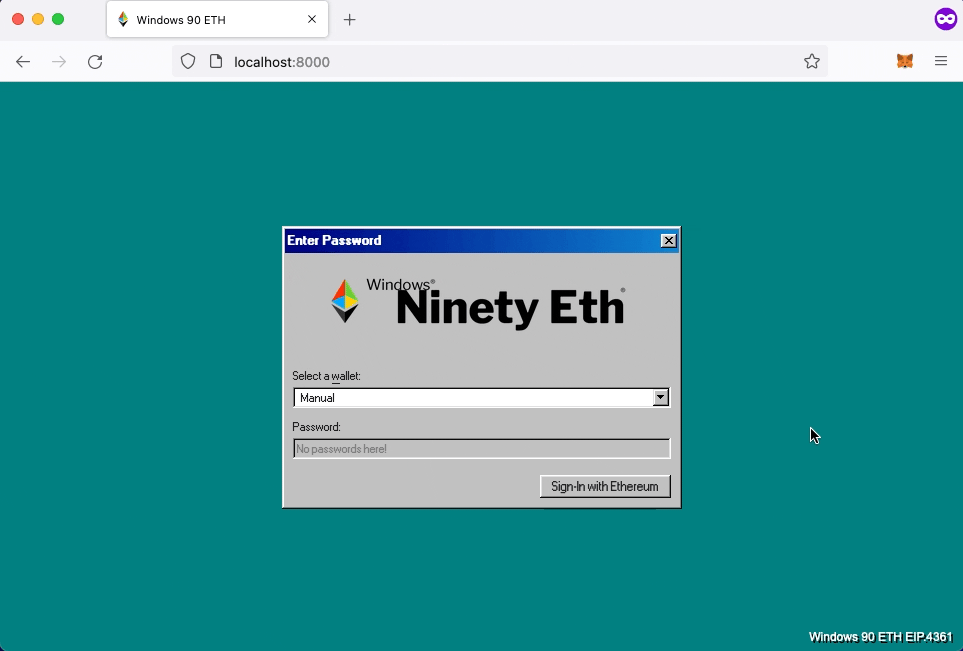

<div id="top"></div>

<!-- PROJECT SHIELDS -->
[![Contributors][contributors-shield]][contributors-url]
[![Forks][forks-shield]][forks-url]
[![Stargazers][stars-shield]][stars-url]
[![Issues][issues-shield]][issues-url]
[![MIT License][license-shield]][license-url]

<!-- PROJECT LOGO -->
<br />
<div align="center">
  <a href="https://github.com/payton/django-siwe-auth">
    
  </a>
<h3 align="center">Django Sign-In with Ethereum Auth</h3>
  <p align="center">
    A complete Django authentication system overhaul for Web3. Treat Ethereum wallets as first-class citizens with authentication via Sign-In with Ethereum (EIP-4361) and authorization via on-chain attributes such as NFT (ERC721/ERC1155) and ERC20 token ownership. 
    <br />
    <h4><b><u>DISCLAIMER: django-siwe-auth is still in early development (it will change often!)</u></b></h4>
    <a href="https://github.com/payton/django-siwe-auth"><strong>Explore the docs »</strong></a>
    <br />
    <br />
    <a href="https://github.com/payton/django-siwe-auth">Live Demo</a>
    ·
    <a href="https://github.com/payton/django-siwe-auth/issues">Report Bug</a>
    ·
    <a href="https://github.com/payton/django-siwe-auth/issues">Request Feature</a>
  </p>
</div>

<!-- TABLE OF CONTENTS -->
<details>
  <summary>Table of Contents</summary>
  <ol>
    <li>
      <a href="#about-the-project">About The Project</a>
    </li>
    <li>
      <a href="#getting-started">Getting Started</a>
    </li>
    <li>
        <a href="#usage">Usage</a>
        <ul>
            <li><a href="#useful-resources">Useful Resources</a></li>
            <li><a href="#install">Install</a></li>
            <li><a href="#rest-api">REST API</a></li>
            <li><a href="#configuring-your-project">Configuring Your Project</a></li>
            <li><a href="#group-plugins">Group Plugins</a></li>
        </ul>
    </li>
    <li><a href="#contributing">Scenarios</a></li>
    <li><a href="#contributing">Contributing</a></li>
    <li><a href="#license">License</a></li>
    <li><a href="#contact">Contact</a></li>
    <li><a href="#acknowledgments">Acknowledgments</a></li>
    <li><a href="#disclaimer">Disclaimer</a></li>
  </ol>
</details>

<!-- ABOUT THE PROJECT -->
## About The Project

This app provides four key features for new or existing Django projects.

<ol>
<li><b>Authentication Backend</b></li>
<ul>
<li>Authenticate incoming requests via the Sign-In with Ethereum (<a href="https://eips.ethereum.org/EIPS/eip-4361">EIP-4361</a>) standard.</li>
</ul>
<li><b>User Model</b></li>
<ul>
<li>Replace original user model with wallet model that is dependent on an Ethereum address.</li>
<li>Removes the liability of storing user credentials in favor of managing transient session data (<a href="https://docs.djangoproject.com/en/4.0/topics/http/sessions/">handled by Django out of the box</a>).</li>
<li><a href="https://ens.domains/">ENS</a> profile information is pulled by default.</li>
</ul>
<li><b>Groups</b></li>
<ul>
<li>Create custom user groups based on on-chain (or off-chain!) attributes.</li>
<li>For example, we can easily define a group of <a href="https://boredapeyachtclub.com/#/">BAYC</a> owners by validating NFT ownership and subsequently serve them special content that non-owners don't have access to.</li>
<li>This extension builds off of Django's well-defined <a href="https://docs.djangoproject.com/en/4.0/topics/auth/default/#permissions-and-authorization">authorization system</a>.</li>
</ul>
</ol>

Below is the included example application that authenticates with an Ethereum address and utilizes on-chain attributes to authorize access to various notepads.
<div align="center">
   
</div>

<p align="right">(<a href="#top">back to top</a>)</p>

<!-- GETTING STARTED -->
## Getting Started

With the included example applications, you can test out Sign-In with Ethereum along with using and creating custom groups. To get an example application up and running follow these steps.

### Prerequisites

Requirements for developing and running examples apps:
* [poetry](https://python-poetry.org/docs/)
* [npm](https://www.npmjs.com/)

### Demo Application

1. Install NPM dependencies
   ```sh
   npm --prefix examples/notepad/frontend install examples/notepad/frontend
   ```
2. Build frontend
   ```sh
   npm run --prefix examples/notepad/frontend build
   ```
3. Install Python dependencies
   ```sh
   poetry install
   ```
4. Set Web3 provider environment variable
   ```sh
   export SIWE_AUTH_PROVIDER="https://mainnet.infura.io/v3/..." # Any provider works
   ```
5. Django migrations
   ```sh
   # Create Django migrations
   poetry run examples/notepad/manage.py makemigrations
   # Apply Django migrations
   poetry run examples/notepad/manage.py migrate
   ```
6. Run server
   ```sh
   poetry run examples/notepad/manage.py runserver
   ```
7. Test application at `https://localhost:8000`

<p align="right">(<a href="#top">back to top</a>)</p>

### Rebuild Demo JavaScript
If you make an update to the frontend directory or siwe submodule, rebuild bundle.js:
```sh
cd examples/notepad/frontend \
npm install \
npm run build
```


<!-- USAGE EXAMPLES -->
## Usage

This project is highly configurable and modular allowing for applications to be as simple or complex as required. Authentication and authorization can be completely replaced or supplemented depending upon the use case. See scenario docs for detailed tutorials.

### Useful Resources
* [User authentication in Django](https://docs.djangoproject.com/en/4.0/topics/auth/)
* [Customizing authentication in Django](https://docs.djangoproject.com/en/4.0/topics/auth/customizing/)
* [How to Switch to a Custom Django User Model Mid-Project](https://www.caktusgroup.com/blog/2019/04/26/how-switch-custom-django-user-model-mid-project/)

### Install

#### Prerequisites

Requirements for using `django-siwe-auth` in a Django application:
* [pip](https://pip.pypa.io/en/stable/installation/)
* [django](https://docs.djangoproject.com/en/4.0/intro/install/)
* An existing [Django project](https://docs.djangoproject.com/en/4.0/intro/tutorial01/)

1. Install package
   ```sh
   pip install django-siwe-auth
   ```
2. Add `siwe_auth.apps.SiweAuthConfig` to INSTALLED_APPS in your project's `settings.py`
   ```python
   INSTALLED_APPS = [
    ...
    "siwe_auth.apps.SiweAuthConfig", # Adds django-siwe-auth
    "django.contrib.admin",
    "django.contrib.auth",
    "django.contrib.contenttypes",
    "django.contrib.sessions",
    "django.contrib.messages",
    "django.contrib.staticfiles",
   ]
   ```
3. Add app-specific definitions to your project's `settings.py` (same files as previous step). For more information, see the <a href="#configuring-your-project">Configuring Your Project</a> section
   ```python
   from siwe_auth.custom_groups.erc721 import ERC721OwnerManager
   ...
   # Django Sign-In with Ethereum Auth Settings
   AUTH_USER_MODEL = "siwe_auth.Wallet"
   AUTHENTICATION_BACKENDS = ["siwe_auth.backend.SiweBackend"]
   LOGIN_URL = "/"
   SESSION_COOKIE_AGE = 3 * 60 * 60 
   CREATE_GROUPS_ON_AUTHN = False # defaults to False
   CREATE_ENS_PROFILE_ON_AUTHN = True # defaults to True
   CUSTOM_GROUPS = [
       ('ens_owners', ERC721OwnerManager(config={'contract': '0x57f1887a8BF19b14fC0dF6Fd9B2acc9Af147eA85'})),
       ('bayc_owners', ERC721OwnerManager(config={'contract': '0xBC4CA0EdA7647A8aB7C2061c2E118A18a936f13D'})),
       ('shib_owners', ERC20OwnerManager(config={'contract': '0x95ad61b0a150d79219dcf64e1e6cc01f0b64c4ce'})),
   ]  # See "Group Plugins" section
   PROVIDER = os.environ.get("SIWE_AUTH_PROVIDER", "https://mainnet.infura.io/v3/...")
   ...
   ```
4. Add `api/auth/` endpoint to your project's `urls.py`
   ```python
   urlpatterns = [
    path("admin/", admin.site.urls),
    path("api/auth/", include("siwe_auth.urls")),
    ...
   ]
   ```
5. Run `manage.py makemigrations` and `manage.py migrate` to create custom user model
6. Update frontend to interface with the <a href="#rest-api">REST API</a> as defined below. An example frontend is available in the notepad demo.
7. Never handle a password ever again!

For more examples, please refer to the [Documentation](https://github.com/payton/django-siwe-auth)

<p align="right">(<a href="#top">back to top</a>)</p>


### REST API

Projects that use this app will interact via these endpoints for authentication. Tools for authorization are provided but not enforced via any endpoints.

#### Login
* Authenticate user based on signed message.

<details>
<summary>/api/auth/logout</summary>

* **Method:**

  `POST`

* **URL Params**

   None

* **Data Params**

  **Required:**
  SIWE Message

* **Success Response:**

   * **Code:** 200 <br />
     **Content:** `{"success": True, "message": "Successful login."}`

* **Error Response:**

   * **Code:** 401 UNAUTHORIZED <br />
     **Content:** `{"success": False, "message": "Wallet disabled."}`

  OR

   * **Code:** 403 FORBIDDEN <br />
     **Content:** `{"success": False, "message": "Invalid login."}`

  OR

    * **Code:** 429 TOO MANY REQUESTS <br />
      **Content:** `{"message": "Too many requests. Slow down."}`

* **Sample Call:**
```javascript
fetch(`/api/auth/login`, {
    method: 'POST',
    body: JSON.stringify({ message }),
    headers: { 'Content-Type': 'application/json' },
    credentials: 'include',
}).then(async (res) => {
    if (res.status === 200) {
        // Success, continue with authenticated flow
    } else {
        // Failure, handle alternative path
    }
});
```

</details>

#### Logout

* Logout authenticated user.

<details>
<summary>/api/auth/logout</summary>

* **Method:**

  `POST`

* **URL Params**

  None

* **Data Params**

  None

* **Success Response:**

    * **Code:** 200 <br />
      **Content:** `{"success": True, "message": "Successful login."}`

* **Error Response:**

    * **Code:** 401 UNAUTHORIZED <br />
      **Content:** `{"success": False, "message": "Wallet disabled."}`

  OR

    * **Code:** 403 FORBIDDEN <br />
      **Content:** `{"success": False, "message": "Invalid login."}`

  OR

    * **Code:** 429 TOO MANY REQUESTS <br />
      **Content:** `{"message": "Too many requests. Slow down."}`

* **Sample Call:**
```javascript
fetch('/api/authentication/logout', {
    method: 'POST',
    credentials: 'include',
}).then(() => {
    // Success, continue with logout flow
});
```
</details>

#### Nonce

* Get temporary nonce to include in EIP-4361 (SIWE) message.

<details>
<summary>/api/auth/nonce</summary>

* **Method:**

  `GET`

* **URL Params**

  None

* **Data Params**

  None

* **Success Response:**

    * **Code:** 200 <br />
      **Content:** `{"success": True, "message": "Successful login."}`

* **Error Response:**

    * **Code:** 429 TOO MANY REQUESTS <br />
      **Content:** `{"message": "Too many requests. Slow down."}`

* **Sample Call:**
```javascript
fetch('/api/authentication/nonce', { 
    credentials: 'include' 
}).then((res) =>
    // Success, continue with message signing flow
);
```
</details>

<p align="right">(<a href="#top">back to top</a>)</p>


### Configuring Your Project

#### Relevant native Django settings

```py
# in settings.py
AUTH_USER_MODEL = "siwe_auth.Wallet" # required for siwe as the default authentication
AUTHENTICATION_BACKENDS = ["siwe_auth.backend.SiweBackend"] # required for siwe as the default authentication
LOGIN_URL = "/" # optional, django's default is "/accounts/login/"
SESSION_COOKIE_AGE = 3 * 60 * 60 # Age of cookie, in seconds. Optional, django's default is weeks.
```

#### django-siwe-auth specific settings
```py
# in settings.py
CREATE_GROUPS_ON_AUTHN = True # optional, default is False
CREATE_ENS_PROFILE_ON_AUTHN = True # optional, default is True
CUSTOM_GROUPS = [] # optional, see "Adding a Group" below
# Set environment variable SIWE_AUTH_PROVIDER for Web3.py
# - Required if CREATE_GROUPS_ON_AUTHN or CREATE_ENS_PROFILE_ON_AUTHN are True. Optional otherwise.
#   Any ethereum API key (infura or alchemy) will work.
PROVIDER = os.environ.get("SIWE_AUTH_PROVIDER", "https://mainnet.infura.io/v3/...")
```


<!-- USAGE EXAMPLES -->
### Group Plugins
A group plugin allows you to define your own group whose membership is defined by the output of a membership function. Some examples of what the membership function may check for include but are not limited to: NFT ownership, ERC-20 token ownership, ENS data, etc.

#### GroupManager Class
All group plugins must implement the GroupManager class. This includes a function called `is_member` that is called to determine group membership when a user authenticates with the server.
```python
from abc import ABC, abstractmethod

class GroupManager(ABC):

   @abstractmethod
   def __init__(self, config: dict):
      pass

   @abstractmethod
    def is_member(self, wallet: object) -> bool:
        pass
```

#### Included Managers

<ul>
<li>ERC20Manager
    <ul>
        <li>ERC20OwnerManager</li>
    </ul>
</li>
<li>ERC721Manager
    <ul>
        <li>ERC721OwnerManager</li>
    </ul>
</li>
<li>ERC1155Manager
    <ul>
        <li>ERC1155OwnerManager</li>
    </ul>
</li>
</ul>

#### Adding a Group
A custom group is defined by a tuple consisting of a name (string), MemberManager implementation.

The GroupManager's config can be used for anything, but some likely usecases are defining contract addresses or address include/exclude lists.

In your project's `settings.py`, append your group to the `CUSTOM_GROUPS` list added in the installation steps.

Suppose we want to have only one group for `BAYC` (ERC721 NFT) owners and another group for `LPT` (ERC20 Token) owners. Our list would then look like:
```python
from siwe_auth.custom_groups.erc721 import ERC721OwnerManager
from siwe_auth.custom_groups.erc20 import ERC20OwnerManager
...
CUSTOM_GROUPS=[
   ('bayc_owners', ERC721OwnerManager(config={'contract': '0xbc4ca0eda7647a8ab7c2061c2e118a18a936f13d'})),
   ('lpt_owners', ERC20OwnerManager(config={'contract': '0x58b6a8a3302369daec383334672404ee733ab239'})),
]
```


## Scenarios (WIP)

Examples:
1. Start a new web app with wallet user model.
2. Replace existing user model with wallet user model (non-trivial).
3. Replace existing user model with weaker wallet user model that implements base model (less non-trivial but still non-trivial).
4. Creating permissions around on-chain based groups.


<!-- CONTRIBUTING -->
## Contributing

Contributions are what make the open source community such an amazing place to learn, inspire, and create. Any contributions you make are **greatly appreciated**.

If you have a suggestion that would make this better, please fork the repo and create a pull request. You can also simply open an issue with the tag "enhancement".
Don't forget to give the project a star! Thanks again!

1. Fork the Project
2. Create your Feature Branch (`git checkout -b feature/AmazingFeature`)
3. Commit your Changes (`git commit -m 'Add some AmazingFeature'`)
4. Push to the Branch (`git push origin feature/AmazingFeature`)
5. Open a Pull Request

<p align="right">(<a href="#top">back to top</a>)</p>


<!-- LICENSE -->
## License

Distributed under the MIT License. See `LICENSE.txt` for more information.

<p align="right">(<a href="#top">back to top</a>)</p>


<!-- CONTACT -->
## Contact

payton - [@paytongarland](https://twitter.com/paytongarland) - paytongarland.eth

Project Link: [https://github.com/payton/django-siwe-auth](https://github.com/payton/django-siwe-auth)

<p align="right">(<a href="#top">back to top</a>)</p>


<!-- ACKNOWLEDGMENTS -->
## Acknowledgments

* [Spruce](https://www.spruceid.com/) - creators of EIP-4361
* [jsdelivr](https://www.jsdelivr.com/) - external static asset distribution in example app
* [Best-README-Template](https://github.com/othneildrew/Best-README-Template)
* [98.css](https://jdan.github.io/98.css/)
* [API Documentation Format](https://gist.github.com/iros/3426278)

<p align="right">(<a href="#top">back to top</a>)</p>

## Disclaimer
This django auth library has not yet undergone a formal security audit. We welcome continued feedback on the usability, architecture, and security of this implementation.

<p align="right">(<a href="#top">back to top</a>)</p>

<!-- MARKDOWN LINKS & IMAGES -->
<!-- https://www.markdownguide.org/basic-syntax/#reference-style-links -->
[contributors-shield]: https://img.shields.io/github/contributors/payton/django-siwe-auth.svg?style=for-the-badge
[contributors-url]: https://github.com/payton/django-siwe-auth/graphs/contributors
[forks-shield]: https://img.shields.io/github/forks/payton/django-siwe-auth.svg?style=for-the-badge
[forks-url]: https://github.com/payton/django-siwe-auth/network/members
[stars-shield]: https://img.shields.io/github/stars/payton/django-siwe-auth.svg?style=for-the-badge
[stars-url]: https://github.com/payton/django-siwe-auth/stargazers
[issues-shield]: https://img.shields.io/github/issues/payton/django-siwe-auth.svg?style=for-the-badge
[issues-url]: https://github.com/payton/django-siwe-auth/issues
[license-shield]: https://img.shields.io/github/license/payton/django-siwe-auth.svg?style=for-the-badge
[license-url]: https://github.com/payton/django-siwe-auth/blob/main/LICENSE.txt
[product-screenshot]: images/screenshot.png
